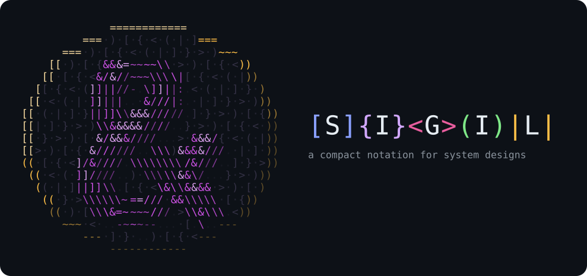

# Sigil

<p align="center"></p>

A notation for system designs, written with your coding agent.

Sigil describes how a system is wired: its components, data, events, actors and
stores, and the calls, events and failures between them, in a few lines of text. Its
tools lint a design, flag the risks it leaves unhandled, draw it in the terminal and
step through its paths. The plugin teaches your coding agent to read and write it.

A URL shortener ([`shortener.sigil`](https://no-tably.github.io/sigil/examples/shortener.sigil)):

```sigil
#!sketch

--- URL shortener ---
(User) -> [Shortener] : shorten({Url}) => {Code}
[Shortener] -> |Links| : save({Code}, {Url})
(Visitor) -> [Redirect] : follow({Code})
[Redirect] -> |Links| : lookup({Code}) => {Url}
           !> (Visitor) : <NotFound>
           -> (Visitor) : redirect({Url})
           ~> <Clicked> -> [Stats]
```

Line by line:

- `(User) -> [Shortener] : shorten({Url}) => {Code}`: a user sends a URL, gets a code.
- `[Shortener] -> |Links| : save({Code}, {Url})`: the pair is stored.
- `(Visitor) -> [Redirect] : follow({Code})`: a visitor follows a code.
- `[Redirect] -> |Links| : lookup({Code}) => {Url}`: it's looked up.
- `!> (Visitor) : <NotFound>`: missing: not found.
- `-> (Visitor) : redirect({Url})`: found: redirected.
- `~> <Clicked> -> [Stats]`: each click, async, to stats.

A line that starts with an arrow continues from the subject above.

`view.py` draws it in the terminal, as a call graph read left to right (the flow
view, its default):

```
── URL shortener ───────────────────────────────────────

    (User) ─────▶ [Shortener] ─┬─▶ |Links|
╭─✖┐(Visitor) ──▶ [Redirect] ──┼╌▶ <Clicked> ──▶ [Stats]
├─▶┘                           │
╰──────────────────────────────╯

shortener.sigil: 7 nodes, 8 edges, 0 expansions · #!sketch
lint: OK
```

`--graph` draws the same design as boxes and edges, top down (`t` steps through
the graph, tree, flow and run views live):

```
── URL shortener ──────────────────

  ╭────────╮       ╭───────────╮
  │ (User) │       │ (Visitor) │
  ╰────────╯       ╰───────────╯
       │                    ▲ ✖
       │                    │ │
       ▼                    │ ▼
┌─────────────┐   ┌────────────┐
│ [Shortener] │   │ [Redirect] │
└─────────────┘   └────────────┘
         │               │
         │       ┌───────┤
         ▼       ▼       ▼
        ┌─────────┐   ┌───────────┐
        │ |Links| │   │ <Clicked> │
        └─────────┘   └───────────┘
                           │
                           ▼
                      ┌─────────┐
                      │ [Stats] │
                      └─────────┘
```

`--sim all` runs both of its paths — the happy one, and a lookup that fails:

```sh
view.py shortener.sigil --once --sim all
```

```
happy                    ok       47 frames  every default: the happy path
Redirect.lookup:fails    failed   32 frames  lookup fails 1×, no fallback
  failed: [Redirect] -> |Links| · (Visitor) -> [Redirect]
  routes: [Redirect] !> (Visitor)
2 scenarios: 1 ok, 1 failed, 0 cut
```

**Try it:** the [project page](https://no-tably.github.io/sigil/) has a
[playground](https://no-tably.github.io/sigil/#playground) that runs these tools in
the browser — write a design, switch views, step through a simulation.

- **Spec:** [`language.md`](./language.md) — glyphs, arrows, modifiers, payloads,
  control-flow blocks, streams, zoom, composition trees (`\-` branches with the
  relations `> & ? $ @ ! = _` and qualified paths like `[Bullet]/{Transform}`),
  modes, normal form, grammar.
- **Design records:** [`rfcs/`](./rfcs/README.md) — accepted RFCs with their decisions.
- **Examples:** [`examples.md`](./examples.md) — worked prose ↔ Sigil pairs.

## Tools

All tools are Python 3 standard library only; each takes a file or `-` for stdin.
Every flag and key is in [`docs/tools.md`](./docs/tools.md).

| Tool | Does |
| --- | --- |
| `view.py FILE` | Live terminal view, redrawn on every save: a flow view (a call graph left to right, the default), a graph view (`--graph`), a tree view (`--tree`) and a run view (one simulated run as a timeline, `--run`) — `1` `2` `3` `4` pick one, `t` steps to the next — a simulation mode (`x`) and a checks overlay (`c`). `--once` prints one drawing for agents and CI. |
| `lint.py FILE` | Validates a document: one `severity:line:rule: message` per issue; exit 0 clean, 1 warnings, 2 errors. `--deep` adds the composition checks. |
| `check.py FILE` | Composition checks ([RFC 0003](./rfcs/0003-composition-checks.md)): does the design say how its risks are handled — time bounds, idempotency, writers, failure routes, stuck state machines? A finding never forbids a shape: declare the handling, or accept the risk with a reason. |
| `render.py FILE` | Emits a Mermaid `flowchart TD` for docs (GitHub, Obsidian, mermaid.live). |
| `themes.py` | Colour themes from `themes/*.yaml`, shared by the viewer and the web page. |
| `dialects.py` | Loads a dialect (`--dialect NAME`) that extends the linter, renderer and checker. |
| `highlight/` | Syntax highlighting for bat, nvim, VS Code, Sublime/TextMate. |

## Install as an agent skill

Sigil ships as a skill (`sigil`) plus two commands (`sigil-view`, `sigil-lint`)
for several coding agents. Each GitHub release attaches one archive per agent,
`sigil-<agent>-<version>.zip` (and `.tar.gz`), plus
`sigil-{claude,codex}-marketplace-<version>` archives. Build them locally with
`./build.py` (see [Development](#development)).

### Claude Code

```sh
# from a release: unzip sigil-claude-marketplace-<version>.zip, then in Claude Code
/plugin marketplace add ./sigil-claude-marketplace-<version>
/plugin install sigil@sigil
# or try it for one session without installing
claude --plugin-dir ./sigil-claude-<version>
```

Commands appear as `/sigil:sigil-view <file>` and `/sigil:sigil-lint <file>`.

The Claude Code plugin also carries a viewer mod. The agent gets a `view` tool
that shows a design to you while you design it together: the graph, tree, flow or
run view, redrawn on every save, and a simulated run stepped or played. Where it draws
is the plugin's `display` option:

- `mod` draws in a pane beside the conversation, in the theme's colours. A pane
  you didn't ask for needs a terminal at least 144 columns wide. When it's
  narrower, the agent's reply says the pane is waiting. `/sigil-pane [FILE]` opens
  it at any width.
- `multiplex` opens a herdr, tmux or zellij split that runs `view.py` live, and
  the agent's later calls update it. Nothing draws in Claude Code.
- `auto` (the default) picks `multiplex` when `HERDR_ENV`, `TMUX` or `ZELLIJ` is
  set, and `mod` otherwise.

Set it with `/sigil-pane display mod|multiplex|auto` (`/sigil-pane display`
says what it is now and what `auto` picks here), in `/config`, or under
`pluginConfigs` in settings.

### Codex

Unzip `sigil-codex-marketplace-<version>.zip` and add it as a local plugin
marketplace (it holds `.agents/plugins/marketplace.json` → `./plugins/sigil`), or
copy the skills straight into a skills directory:

```sh
unzip sigil-codex-<version>.zip
cp -R sigil-codex-<version>/skills/* ~/.agents/skills/     # or <repo>/.agents/skills/
```

The commands become explicit-only skills: invoke them as `$sigil-view` /
`$sigil-lint`.

### pi

```sh
unzip sigil-pi-<version>.zip
pi install ./sigil-pi-<version>        # add -l to install for this project only
```

Provides the `sigil` skill and the `/sigil-view` and `/sigil-lint` prompts.

The pi package also carries a viewer extension, which works like the Claude Code
mod. The agent gets a `sigil_view` tool, and you get a `/sigil-pane` command. With
`mod` display it draws in a widget above the editor, and a widget you didn't ask
for needs 144 columns. With `multiplex` it opens a herdr, tmux or zellij split.
`auto` picks between them the same way. Choose with `/sigil-pane display
mod|multiplex|auto`, which saves it to `~/.config/sigil/viewer.json`; for one
session, `pi --sigil-display …` or `SIGIL_DISPLAY` wins over that.

### OpenCode

```sh
unzip sigil-opencode-<version>.zip
./sigil-opencode-<version>/install.sh                   # ~/.config/opencode
./sigil-opencode-<version>/install.sh --project .       # ./.opencode
```

Provides the `sigil` skill and the `/sigil-view` and `/sigil-lint` commands.
(OpenCode also discovers skills in `~/.claude/skills` and `.agents/skills`.)

OpenCode gets no viewer plugin. To watch a design live, run `view.py FILE` in a
herdr, tmux or zellij split; the agent reads `view.py --once`.
[`docs/tools.md`](./docs/tools.md#opencode) says why.

## Simulation

Sigil does not execute, but the viewer can *walk* a design: `sim.py` reads it as
tokens moving along its flows, so you can watch the happy path, each failure
route, each branch arm, race and alternative play out over the same drawing — in
the graph view and the tree view alike. No values are computed and nothing is
random; the run is a function of the design and the chosen **scenario**.

- **Scenarios** are the design's pathways, each with a stable name: `happy` (every
  default: calls succeed, `?>` not taken, the first member of a race / alternative /
  branch wins), then one per deviation — `API.charge:fails` (an op call fails:
  `Caller.verb:fails`, or `:fallback` when it falls back), `API->Payments:fails` (a
  plain call with `×N` / `@timeout` / `@fallback` / a `!>` route fails),
  `Risk?>Review` (a conditional taken), `Payments:fails` (a node with a `!>` route
  fails), `Api&?PspB` (another race winner), `Api/Err` (another alternative), a
  branch arm, … Join two with `a+b`. An unknown name prints the known ones (exit 2).
- **What moves:** `->` calls wait for their return, `~>` forks without waiting,
  `*>` and `&` fork to all and wait for all, `!>` fires only on failure, retries
  count their attempts, events drive the state machines that name them (each
  machine's current state is marked `◉`), loops and recursion are bounded.
- **Levels:** an expansion is a closer reading of its node, so an outer flow whose
  target the expansion also reaches by a flow (not only by a failure route or
  an optional `?>`) is a summary of that detail — `[Shop] ~>
  <OrderPlaced>` over `[Checkout] ~> <OrderPlaced>` inside `[Shop] := { … }` — and
  runs once, as the detail (the summary lights with it).
- **The marks:** `●` a token going out, `○` a return or fallback, `✕` a failure (in
  the failure colour), `⊘` cancelled; the wire a token is on now bright, the wires
  taken before faded, the ones never taken fainter; `…` waiting, `×n`
  spawned instances, `↻k` recursion depth.
- **In words:** every step of a run reads as a sentence — `[API] calls [Payments]
  with charge(total) — attempt 2 of 4`, `|Orders| returns {Order} to [API]`,
  `[Checkout] moves Idle → Busy on <Placed>`.

Live, `x` enters sim mode in any of the four views. Space plays and pauses, `,` /
`.` step a frame, `<` / `>` step to the previous / next event, `[` / `]` pick the
scenario (named in the status bar), and `-` / `+` set the speed (¼ to 32 frames a
second, starting at 2). Under the drawing, `path` writes the episode's hops so far
in notation, numbered by branch — `① (Shopper) -> [API] -> [Payments] ✖×4   ② [API]
!> <PaymentFailed>`, `✖` a failed hop, `⊘` a cancelled one, the hop a token is on
now in bold — then come the last few events and the narration line (`›`, what is
happening now). The view follows the run as it moves; `w` turns that off. For agents
and CI, `--once --sim SCENARIO` prints the run's last frame (or `--frame N`'s), the outcome, its path
and the run in words (here
[`examples/checkout.sigil`](https://no-tably.github.io/sigil/examples/checkout.sigil)
with its card charge failing; legend and lint summary left out):

```sh
view.py checkout.sigil --once --tree --sim 'API.charge:fails'
```

```
── checkout ──────────────────────────────
  (Shopper) ✕ ───────────────●
  [API] ✕ ◀──────────────────┴═●═✖═●═›═›═›
  [Payments] ✕ ◀───────────────┘ │ │ ║ ║ ║
  <PaymentFailed> ◀──────────────┘ │ ║ ║ ║
  |Orders| ◀───────────────────────┘ ║ ║ ║
  [Email] <OrderPlaced> ◀════════════╝ ║ ║
  [Shipping] <OrderPlaced> ◀═══════════╝ ║
  |Ledger| <OrderPlaced> ◀═══════════════╝

sim API.charge:fails (charge fails 4×, no fallback): failed · 31 frames
path   ① (Shopper) -> [API] -> [Payments] ✖×4   ② [API] !> <PaymentFailed>
t000 conventions: written order; entries one after another; ?> not taken by default; the first member wins a race / alternative / branch
t000 episode 1 begins at (Shopper); (Shopper) calls [API] with {Cart}
t005 [API] calls [Payments] with charge(total) — attempt 1 of 4
t009 charge(total) to [Payments] fails — attempt 1 of 4
t010 [API] calls [Payments] with charge(total) — attempt 2 of 4
t014 charge(total) to [Payments] fails — attempt 2 of 4
t015 [API] calls [Payments] with charge(total) — attempt 3 of 4
t019 charge(total) to [Payments] fails — attempt 3 of 4
t020 [API] calls [Payments] with charge(total) — attempt 4 of 4
t024 charge(total) to [Payments] fails — attempt 4 of 4
t025 [API]'s call to [Payments] fails after 4 attempts; [API] routes the failure to <PaymentFailed>
t030 (Shopper)'s call to [API] fails — its callee failed; episode 1 fails; the run ends: failed
```

The run view (`--run`, `4` live) draws the same run as a timeline: a lane per
participant (per instance, per recursion level), time left to right, a bar per
activation (`█` working, `░` waiting), each call drawn at its send tick, each
retry a repeated segment, and a note per lane in plain words. Without `--sim` it
draws the happy run.

```sh
view.py checkout.sigil --once --run --sim 'API.charge:fails'
```

```
── run · API.charge:fails — charge fails 4×, no fallback ───────────────────────────────────────────

                  0         10        20        30
  (Shopper)       █░░░░░░░░░░░░░░░░░░░░░░░░░░░░░✕   episode 1's entry; calls [API]; fails
  [API]           ╰──▶██░░░░█░░░░█░░░░█░░░░█░░░░✕   calls [Payments]; routes the failure; fails
  [Payments]           ╰───✖╰───✖╰───✖╰───✖│        4 attempts, each fails
  <PaymentFailed>                          ╰──✖◆    lands
```

An agent designing with you runs every scenario at once: `--sim all` prints, with no
drawing, a line per run (name, outcome, frames, label) and the facts that judge it
(each state machine's end state, what failed, the routes taken, any bound hit), then
a summary. Diff two versions' tables to see what a change did to the design's
behaviour; `--sim list` lists the scenarios and `--json` prints either as JSON
(`--sim NAME --json`: one run's facts, its steps in words and its raw log).

```sh
view.py orders.sigil --once --sim all
```

```
happy                    ok       32 frames  every default: the happy path
  states: [Checkout] Idle · {Order} Settled
Payments:fails           failed   32 frames  Payments fails → Declined
  states: [Checkout] Idle · {Order} Cancelled
  failed: [Payments]
  routes: [Payments] !> <Declined>
2 scenarios: 1 ok, 1 failed, 0 cut
```

## Themes

One YAML file colours both the terminal viewer and the web page:
`themes/sigil.yaml` (the default) holds a `palette` of named colours and the roles
built from it — `kinds` (box colours by glyph; `kinds.service` colours
`[component]` glyphs), `edges`, `syntax` (code highlighting), `ui` (viewer
chrome) and `site`. A value `$name` refers to `palette.name`, so a role follows
its palette colour; a new theme can start with `extends: sigil` and override
only what it changes. Drop it in `themes/` or a directory on `SIGIL_THEME_PATH`.
The format is a small YAML subset (nested maps, scalars, `#` comments) that
`themes.py` and the page both parse without a YAML library.

## Web page

`site/` is a static page: an explainer, a live editor that types the examples in
`site/examples/` line by line while `view.py`'s four views redraw on planes in a 3D
background, a strip of short sections that brings each plane forward in turn (the
run view playing the URL shortener's happy and failing runs), the skill, and install
commands. `site/build_site.py` renders every typing step and those runs through
`view.py` into `frames.json` and turns the theme YAML into CSS variables;
`.github/workflows/pages.yml` publishes it with GitHub Pages.

The **playground** runs the tools themselves in the browser: the build copies
`view.py`, `lint.py`, `sim.py` and the modules they load into `py/` byte for byte, and
[Pyodide](https://pyodide.org) runs them when a visitor presses *start*
(`site/playground.py` is the thin JSON layer the page calls). Write a design, switch
views (graph, tree, flow, run — `1` `2` `3` `4` or `t` on the drawing, as in the viewer), read
the lint, pick a scenario and step through its run, a frame or an event at a time,
with the viewer's path and narration line under the drawing; *share* puts the
document in the link. Nothing about the notation is re-implemented in JavaScript, so
the page cannot drift from the CLI (`tests/test_site.py` checks the copies and that
the playground draws what `view.py` draws).

```sh
python3 site/build_site.py --out _site && python3 -m http.server -d _site 8000
```

`?theme=NAME` previews another theme from `themes/`.

## Dialects

Plain Sigil is domain-neutral. A **dialect** layers extra vocabulary on top —
additional modifiers, lint passes and render rules — without changing the core
language. Dialects are Python modules loaded by `dialects.py` from a path or
from directories on `SIGIL_DIALECT_PATH`; select one with `--dialect NAME` or
`SIGIL_DIALECT=NAME`. For example, `sigil-merlang` (maintained separately) adds a
component type system and UI-layout vocabulary for one agent runtime. See
"Dialects" in [`language.md`](./language.md) for the extension API.

## Development

```sh
python3 -m unittest discover tests          # all tests
./build.py                                   # build every target into dist/
./build.py --target claude --version 1.2.3   # one target, explicit version
./build.py --check                           # validate dist/ (CI runs this)
```

### Layout

The modules sit flat at the top level so each runs as a script, ships into the
skill's `scripts/` unchanged and runs byte for byte in the playground:

```text
render.py    parse a design into a graph; render it as Mermaid        ┐
lint.py      the linter (SGLnnn)                                     │ the core
dialects.py  layer-1 hooks: extra vocabulary, rules, a rule pack     ┘
scene.py     one shared scene: wires, roles, colours, notes, joins   ┐
sim.py       the simulator: scenarios → runs of frames               │ the engine
check.py     the checker (SGCnnn) and its rule modules:              │
  check_flow.py · check_state.py · check_trace.py · check_inv.py     ┘
view.py      the terminal viewer app                                 ┐
viewkit.py   its drawing kit                                         │ the viewer
view_graph.py · view_flow.py · view_tree.py · view_run.py  the views │
themes.py    YAML themes (themes/), shared with the page             ┘
build.py     packaging (maintainers only)
site/  the page and playground · tools/  golden drawings, doc regeneration
docs/  the tools reference, viewer coverage audit · rfcs/  design records
tests/  unit tests, fixtures and golden drawings · highlight/  editor grammars
```

`build.py`'s `TOOLS` is the one list of shipped modules; the page's playground copies
the same list, and a test fails if a new top-level module is missing from it.

Canonical packaging sources — edit these, never `dist/`:

- `skills/sigil/SKILL.md` — the skill, with spec-only frontmatter and paths
  relative to the skill (`scripts/…`, `references/…`).
- `plugin/meta.json` — name, version, description, author, keywords.
- `plugin/commands/*.md` — commands, using `$1` / `$ARGUMENTS` and the
  `@SCRIPTS@` placeholder for the skill's scripts directory.
- `plugin/claude/` — the Claude Code viewer mod: `hooks/` (the TypeScript hooks
  module), `types/`, `scripts/pane.py` (its Python half) and its own `tests/`
  (`claude plugin test plugin/claude`). See [`plugin/claude/README.md`](plugin/claude/README.md).
- `plugin/pi/` — the pi viewer extension: `extensions/sigil/index.ts`, which shares
  the mod's `hooks/logic.ts`. See [`plugin/pi/README.md`](plugin/pi/README.md).

`build.py` copies `lint.py`, `render.py`, the viewer (`view.py` with `viewkit.py`,
`view_graph.py`, `view_tree.py`, `view_flow.py`, `view_run.py`, `scene.py` and `sim.py`), the checker (`check.py` with `check_flow.py`,
`check_state.py`, `check_trace.py` and `check_inv.py`), `dialects.py` and `themes.py`
(with `themes/*.yaml`) into `skills/sigil/scripts/` and `language.md` / `examples.md` into
`skills/sigil/references/`, then writes each agent's manifests. Archives are
deterministic. CI (`.github/workflows/ci.yml`) tests, builds and validates on
every push; pushing a `v*` tag builds with that version and attaches the
archives to a GitHub Release.

## License

MIT — see [`LICENSE`](./LICENSE).
